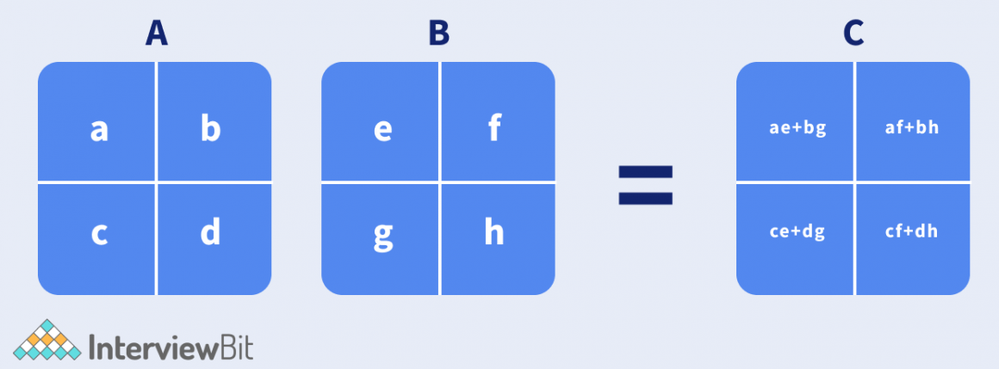
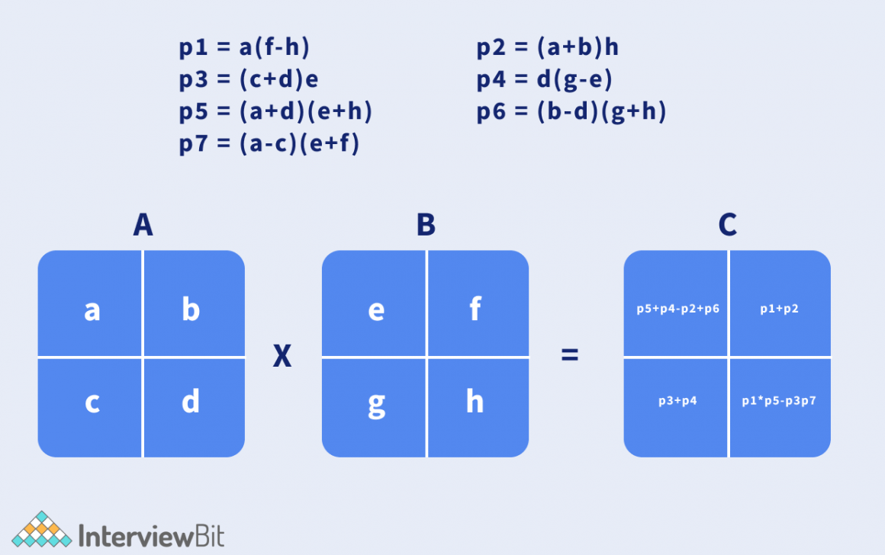
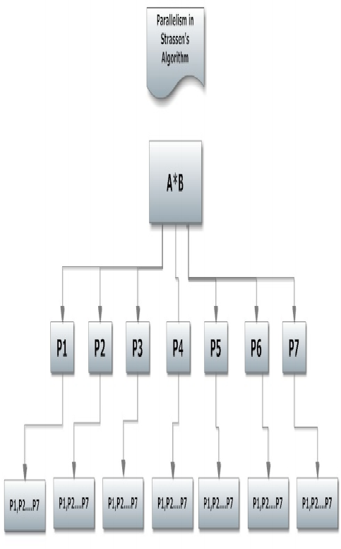
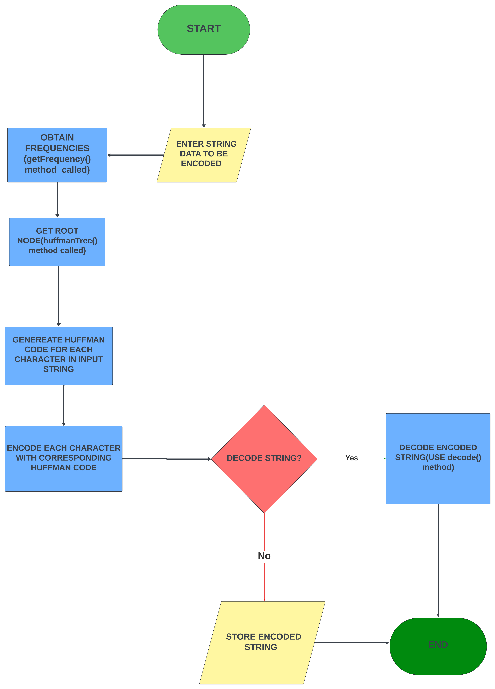

# Assignment_5

## Quickhull Algorithm
The Quickhull Algorithm is a divide and conquer algorithm that is used to find the convex hull of a set of points. The convex hull is the smallest convex polygonal shape around the set of points. Basically, it draws a polygon using the points, making sure that no point is outside the drawn polygon.

### Algorithm
1. Find the minimum and maximum x points. Add these points to the convex hull.
2. Partition the points into those above and below the line.
3. Find the max distance point from each partition and form a triangle. Add these points to the convex hull. 
4. Disregard the points found inside the triangle from the convex hull search, as they cannot be part of the convex hull.
5. Now, recursively perform the quickhull algorithm on the remaining possible convex hull points, until there are no more possible convex hull points. 

### Pseudocode
```
function quickHull(points):
    hull = empty ArrayList of points

    if points.size() < 3:
        return points

    arrangedPoints = arrangePoints(points)
    minAndMaxPoints = findMinAndMaxPoints(arrangedPoints)
    minPoint = minAndMaxPoints[0]
    maxPoint = minAndMaxPoints[1]

    hull.add(minPoint)
    hull.add(maxPoint)

    pointsAbovePartition = findPointsAbovePartition(arrangedPoints, minAndMaxPoints)
    pointsBelowPartition = findPointsBelowPartition(arrangedPoints, minAndMaxPoints)

    pointsWithMaxDistance = findMaxDistanceFromMaxAndMinPoints(pointsAbovePartition, pointsBelowPartition, minAndMaxPoints)

    pointsAfterQuickHull = removePointsInsideTriangle(minAndMaxPoints, pointsWithMaxDistance[0], pointsWithMaxDistance[1], pointsAbovePartition, pointsBelowPartition)

    remainingHullPoints = empty ArrayList of points
    remainingHullPoints.addAll(quickHull(pointsAfterQuickHull[0]))
    remainingHullPoints.addAll(quickHull(pointsAfterQuickHull[1]))

    return remainingHullPoints
```

### Flowchart


### Time Complexity
The time complexity of the Quickhull algorithm can be calculated by using The Master Theorem. 
The Master Theorem finds the time complexity of a divide and conquer algorithm, which can be expressed as a recurrence relation.

The general form of the recurrence relation is
$$ \begin{equation} T(n) = aT(\frac{n}{b}) + O(n) \end{equation} $$
where:
- $ a $ is the number of subproblems in the algorithm
- $ \frac{n}{b} $ is the size of each subproblem
- $ f(n) $ is the cost of the work done outside of the recursive calls.

After finding the recursive function of the algorithm, if $ f(n) = O (n^d) $ for some $ d \ge 1 $, then the time complexity is given as

$$ 
\begin{equation}
T(n)=
    \begin{cases}
        O(n^d) & \text{if } a \ > \ b^d \\
        O(n^d\log n) & \text{if } a \ = \ b^d \\
        O(n^{log_ba}) & \text{if } a \ < \ b^d \
    \end{cases}
\end{equation}
$$

In the Quickhull algorithm, we have that:
- $ a = 2 $ since we divide the set of points into two.
- $ b = 2 $ since each subproblem is also divided into two
- $ f(n) = O(n) $ because the work done outside the algorithm includes: 
    - Finding the Min and Max Points: $ O(n) $
    - Partitioning Points: $ O(n) $
    - Finding the Farthest Points: $ O(n) $
    - Removing Points Inside the Triangle: $ O(n) $

Thus, the recurrence relation for the Quickhull Algorithm becomes, from $ (1) $:

$$ \begin{equation} T(n) = 2T(\frac{n}{2}) + O(n) \end{equation} $$

Since $ f(n) = O(n) $, we have that $ d = 1 $ and $ b^d = 2^1 = 2 $

Comparing $ a $ and $ b^d $, we see that $ a = b^d $, which satisfies the second condition from $ (2) $, meaning that its time complexity is of the form $ O(n^d \log n) $

Since $ d = 1 $, the time complexity of the Quickhull Algorithm is 
$$ O(n \log n) $$

## Strassen's Matrix Multiplication

This algorithm is used to multiply to matrices of the same size(i.e n x n). It is faster than the traditional matrix multiplication algorithm. It uses the divide and conquer method to achieve this.

#### Pseudocode



1. Divide the two matrices into 4 sub-matrices of size n/2 x n/2 as shown above

2. Calculate the 7 matrix multiplications recursively

3. Compute the submatrices of C as shown below
   

4. Combine the submatrices into a new matrix

#### Time Complexity

T(N) = 7T(N/2) + O(N^(log7))
T(N) = 7T(N/2) + O(N^2.8074)
It has worst case of O(N^2.8074)

It's time complexity is closer to the traditonal method but faster it. From the graph below the green line is the Strasen's algorithm and the blue line is the traditional algorithm


#### Flowchart



## Prim's Minimum Spanning Tree

Prim's algorithm is a greedy algorithm used to find the minimum spanning tree of an undirected graph.If finds the sum of edges containing all the vertexes of the graph that would give the leat weight.

## Time Complexity

The time complexity of Prim's algorithm can vary depending on how the graph is represented and how the priority queue is implemented. From the implementation provided above, Prim's algorithm has a time complexity of:
O((V + E) log V), where
V = number of vertices and E = number of edges

## Flowchart


## Pseudocode

// Define the Edge class

Class Edge:
int startVertex
int endVertex
int weight

    // Constructor to initialize the edge
    Method Edge(startVertex, endVertex, weight):
        this.startVertex = startVertex
        this.endVertex = endVertex
        this.weight = weight

    // Method to compare edges based on weight
    Method compareTo(other):
        Return this.weight - other.weight

    // Define the Prim's MST class
    Class PrimsMST:

    // Method to find the MST using Prim's algorithm
    Method primMST(adjacencyList, numberOfVertices):
        // Initialize variables
        isInMST = Array of boolean[numberOfVertices]
        minHeap = PriorityQueue of Edge
        minimumWeight = Array of int[numberOfVertices]
        parentVertex = Array of int[numberOfVertices]

        // Initialize minimum weights to infinity
        For i = 0 to numberOfVertices - 1:
            minimumWeight[i] = INFINITY

        // Start from the first vertex
        minimumWeight[0] = 0
        parentVertex[0] = -1

        // Add the first vertex to the priority queue
        minHeap.add(Edge(-1, 0, 0))

        // While the priority queue is not empty
        While minHeap is not empty:
            currentEdge = minHeap.poll()
            currentVertex = currentEdge.endVertex

            // If the current vertex is already in MST, continue
            If isInMST[currentVertex]:
                Continue

            // Include the current vertex in MST
            isInMST[currentVertex] = true

            // Process all adjacent vertices
            For each adjacentEdge in adjacencyList[currentVertex]:
                adjacentVertex = adjacentEdge.endVertex
                edgeWeight = adjacentEdge.weight

                // If the adjacent vertex is not in MST and the edge weight is less than the current minimum weight
                If not isInMST[adjacentVertex] and edgeWeight < minimumWeight[adjacentVertex]:
                    minimumWeight[adjacentVertex] = edgeWeight
                    minHeap.add(Edge(currentVertex, adjacentVertex, edgeWeight))
                    parentVertex[adjacentVertex] = currentVertex

           // Print the constructed MST
        Print "Edge \tWeight"
        For vertex = 1 to numberOfVertices - 1:
            Print parentVertex[vertex] + " - " + vertex + "\t" + minimumWeight[vertex]

## Kruskal MST Algorithm
           Kruskal’s MST : this is a type of an algorithm that  sorts all edges of a  graph by their weights and adds them to the MST one by one, ensuring that no cycles are formed.

            ##Pseudocode

            function KruskalMST(graph):
    result = []  // This will store the resultant MST
    i = 0        // Index variable for sorted edges
    e = 0        // Index variable for result[]

    // Step 1: Sort all the edges in non-decreasing order of their weight.
    sort(graph.edges)

    // Allocate memory for creating V subsets
    subsets = []
    for v in range(graph.V):
        subsets[v] = {parent: v, rank: 0}

    // Number of edges to be taken is equal to V-1
    while e < graph.V - 1:
        // Step 2: Pick the smallest edge and increment the index for next iteration
        next_edge = graph.edges[i]
        i = i + 1

        x = find(subsets, next_edge.src)
        y = find(subsets, next_edge.dest)

        // If including this edge does not cause a cycle, include it in the result and increment the index of result for next edge
        if x != y:
            e = e + 1
            result.append(next_edge)
            union(subsets, x, y)

    // Print the contents of result[] to display the built MST
    for each edge in result:
        print(edge.src, edge.dest, edge.weight)


## Time Complexity

Sorting Edges: O(E log E)O(E \log E)O(ElogE), where E is the number of edges.
Union-Find Operations: Almost O(E)O(E)O(E) due to the inverse Ackermann function.
Overall Time Complexity: O(ElogE+Eα(V))≈O(ElogE)O(E \log E + E \alpha(V)) 
\approx O(E \log E)O(ElogE+Eα(V))≈O(ElogE).

## Flowchart

Start

Sort Edges by Weight

Initiaze Subsets for each vertex
While edges in MST<v-1

Yes
Select the next smallest edge

Find roots of the sets to which the selected edge’s vertices belong

If in differnt sets:
Add edges to MST
Union the sets

End


## HUFFMAN CODES

### TIME COMPLEXITY ANALYSIS
The time complexity of Huffman codes algorithm is O(nlog n), where n is the number of characters in the input string.
The construction of the Huffman tree was done by repeatedly merging nodes of smaller frequencies(which became leafs to a
parent node).
This accounts for the algorithm's logarithmic time complexity.


### FLOWCHART



### PSEUDOCODE
Class HuffmanCodes :
    //method obtains frequencies of each character
 HashMap<Character, Integer> getFrequency(String inputText) {
        HashMap<Character, Integer> frequency = new HashMap<>();

        for each char character in inputText.toCharArray()) :
            frequency.addto(character, frequency.getOrDefault(character, 0) + 1);
        
        return frequency;
    

    //Node class with two constructors
    Class Node:
        //attributes of Node class
        int frequency;
        char character;
        Node leftNode;
        Node rightNode;
        
        //1ST constructor initializes frequency and character attributes
        constructor Node (char character, int frequency):
            this.character = character;
            this.frequency = frequency;
            
        //2ND constructor initializes frequency,left and right Nodes
       constructor Node(int frequency, Node leftNode, Node rightNode):
            this.frequency = frequency;
            this.leftNode = leftNode;
            this.rightNode = rightNode;
        
//building the huffman tree to obtain root node
Node huffmanTree(HashMap<Character, Integer> frequencyMap):
        PriorityQueue<Node> huffmanQueue = new PriorityQueue<>();
        
         //adding nodes to the PriorityQueue
        For each char character in frequencyMap.keySet():
            huffmanQueue.add(new Node(character,frequencyMap.get(character)));
        End For
        

        //compressing each node into one root node
        While huffmanQueue.size()>1:
            Node leftNode= huffmanQueue.smallestElement();
            Node rightNode=huffmanQueue.samallestElement();
            Node parentNode = new Node(left.frequency+right.frequency,leftNode,rightNode);
            huffmanQueue.add(parentNode);
         End While
            
        //returning the root node
        return huffmanQueue.lastElement();
    
//Huffman code generation for each character
HashMap<Character,String> huffmanCodes(Node root):
         HashMap<Character,String> characterCodeMap = new HashMap<>();
         codeGenerator(root," ",characterCodeMap);
           return characterCodeMap;
    

//codeGenerator method
void codeGenerator(Node node,String code,HashMap<Character,String> characterCodeMap):
        If node==null:
            characterCodeMap.put(' ',"");
       End If
            
        If node.left== null && node.right==null:
            characterCodeMap.put(node.character,code);
       End If
            
        Else:
            codeGenerator(node.left,code+"0",characterCodeMap);
            codeGenerator(node.right,code+"1",characterCodeMap);
        End Else
        
    

//encoding the input text
String encode(String inputString,HashMap<Character,String> characterCodeMap):
      StringBuilder encodedString= new StringBuilder();

        For each char character in inputString.toCharArray()):
            encodedString.append(characterCodeMap.get(character));
            End For
        
        return encodedString.changeToString();
    
//Decoding encoded text
String decode(String encodedString,Node rootNode):
        StringBuilder decodedString = new StringBuilder();
        Node currentNode =rootNode;

        For each char nodeBit in encodedString.toCharArray():            
            If nodeBit is equal to'0':
                currentNode=currentNode.left;
            End If
            
            Else If nodeBit is equal to'1':
                currentNode=currentNode.right;
            End Else If
            
            If currentNode.left is equal to null && currentNode.right is equal to null:
                decodedString.append(currentNode.character);
                currentNode=rootNode;
            End If
         End For
            
        return decodedString.changeToString();
