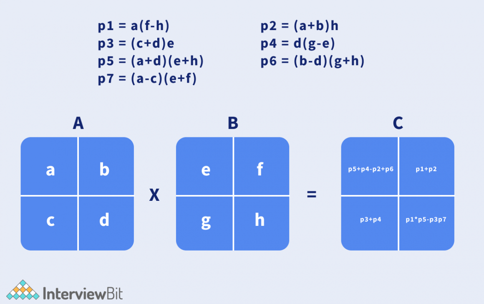
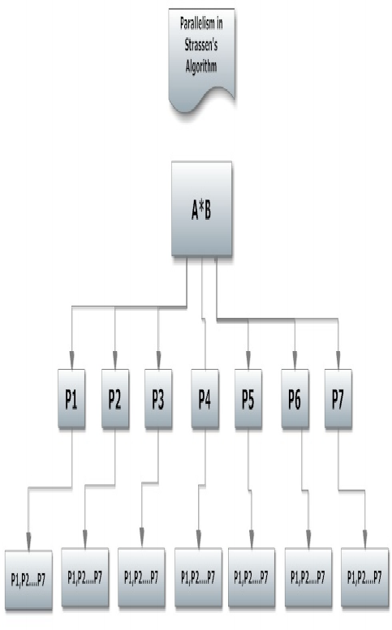

# Assignment_5

## Strassen's Matrix Multiplication

This algorithm is used to multiply to matrices of the same size(i.e n x n). It is faster than the traditional matrix multiplication algorithm. It uses the divide and conquer method to achieve this.

#### Pseudocode

1. Divide the two matrices into 4 sub-matrices of size n/2 x n/2 as shown above

2. Calculate the 7 matrix multiplications recursively

3. Compute the submatrices of C as shown below
   

4. Combine the submatrices into a new matrix

#### Time Complexity

T(N) = 7T(N/2) + O(N^(log7))
T(N) = 7T(N/2) + O(N^2.8074)
It has worst case of O(N^2.8074)

It's time complexity is closer to the traditonal method but faster it. From the graph below the green line is the Strasen's algorithm and the blue line is the traditional algorithm

#### Flowchart

## Prim's Minimum Spanning Tree

Prim's algorithm is a greedy algorithm used to find the minimum spanning tree of an undirected graph.If finds the sum of edges containing all the vertexes of the graph that would give the leat weight.

## Time Complexity

The time complexity of Prim's algorithm can vary depending on how the graph is represented and how the priority queue is implemented. From the implementation provided above, Prim's algorithm has a time complexity of:
O((V + E) log V), where
V = number of vertices and E = number of edges

## Flowchart

## Pseudocode

// Define the Edge class

Class Edge:
int startVertex
int endVertex
int weight

    // Constructor to initialize the edge
    Method Edge(startVertex, endVertex, weight):
        this.startVertex = startVertex
        this.endVertex = endVertex
        this.weight = weight

    // Method to compare edges based on weight
    Method compareTo(other):
        Return this.weight - other.weight

    // Define the Prim's MST class
    Class PrimsMST:

    // Method to find the MST using Prim's algorithm
    Method primMST(adjacencyList, numberOfVertices):
        // Initialize variables
        isInMST = Array of boolean[numberOfVertices]
        minHeap = PriorityQueue of Edge
        minimumWeight = Array of int[numberOfVertices]
        parentVertex = Array of int[numberOfVertices]

        // Initialize minimum weights to infinity
        For i = 0 to numberOfVertices - 1:
            minimumWeight[i] = INFINITY

        // Start from the first vertex
        minimumWeight[0] = 0
        parentVertex[0] = -1

        // Add the first vertex to the priority queue
        minHeap.add(Edge(-1, 0, 0))

        // While the priority queue is not empty
        While minHeap is not empty:
            currentEdge = minHeap.poll()
            currentVertex = currentEdge.endVertex

            // If the current vertex is already in MST, continue
            If isInMST[currentVertex]:
                Continue

            // Include the current vertex in MST
            isInMST[currentVertex] = true

            // Process all adjacent vertices
            For each adjacentEdge in adjacencyList[currentVertex]:
                adjacentVertex = adjacentEdge.endVertex
                edgeWeight = adjacentEdge.weight

                // If the adjacent vertex is not in MST and the edge weight is less than the current minimum weight
                If not isInMST[adjacentVertex] and edgeWeight < minimumWeight[adjacentVertex]:
                    minimumWeight[adjacentVertex] = edgeWeight
                    minHeap.add(Edge(currentVertex, adjacentVertex, edgeWeight))
                    parentVertex[adjacentVertex] = currentVertex

           // Print the constructed MST
        Print "Edge \tWeight"
        For vertex = 1 to numberOfVertices - 1:
            Print parentVertex[vertex] + " - " + vertex + "\t" + minimumWeight[vertex]

            #Kruskal MST Algorithm
           Kruskal’s MST : this is a type of an algorithm that  sorts all edges of a  graph by their weights and adds them to the MST one by one, ensuring that no cycles are formed.

            ##Pseudocode

            function KruskalMST(graph):
    result = []  // This will store the resultant MST
    i = 0        // Index variable for sorted edges
    e = 0        // Index variable for result[]

    // Step 1: Sort all the edges in non-decreasing order of their weight.
    sort(graph.edges)

    // Allocate memory for creating V subsets
    subsets = []
    for v in range(graph.V):
        subsets[v] = {parent: v, rank: 0}

    // Number of edges to be taken is equal to V-1
    while e < graph.V - 1:
        // Step 2: Pick the smallest edge and increment the index for next iteration
        next_edge = graph.edges[i]
        i = i + 1

        x = find(subsets, next_edge.src)
        y = find(subsets, next_edge.dest)

        // If including this edge does not cause a cycle, include it in the result and increment the index of result for next edge
        if x != y:
            e = e + 1
            result.append(next_edge)
            union(subsets, x, y)

    // Print the contents of result[] to display the built MST
    for each edge in result:
        print(edge.src, edge.dest, edge.weight)

## Time Complexity

Sorting Edges: O(E log E)O(E \log E)O(ElogE), where E is the number of edges.
Union-Find Operations: Almost O(E)O(E)O(E) due to the inverse Ackermann function.
Overall Time Complexity: O(ElogE+Eα(V))≈O(ElogE)O(E \log E + E \alpha(V)) 
\approx O(E \log E)O(ElogE+Eα(V))≈O(ElogE).

## Flowchart

Start

Sort Edges by Weight

Initiaze Subsets for each vertex
While edges in MST<v-1

Yes
Select the next smallest edge

Find roots of the sets to which the selected edge’s vertices belong

If in differnt sets:
Add edges to MST
Union the sets

End

